# Responsive restaurant website using  HTML, CSS and Javascript.
### `website is deplyoed on below link`
  [click here](https://restaurant-react-csk.netlify.app/) \
  or the link below \
  https://restaurant-react-csk.netlify.app/

### `output screenshots`
  #### Navbar and Home
  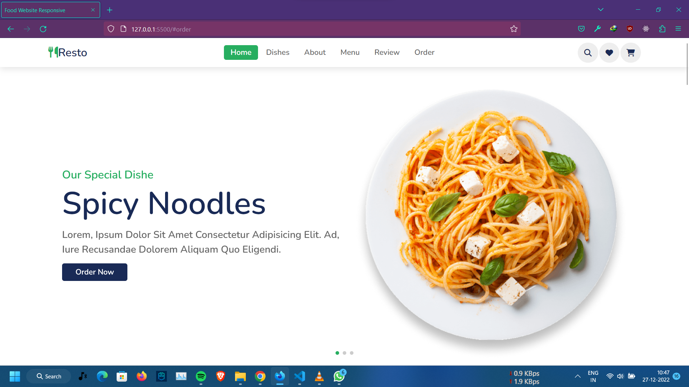 
  #### dishes
  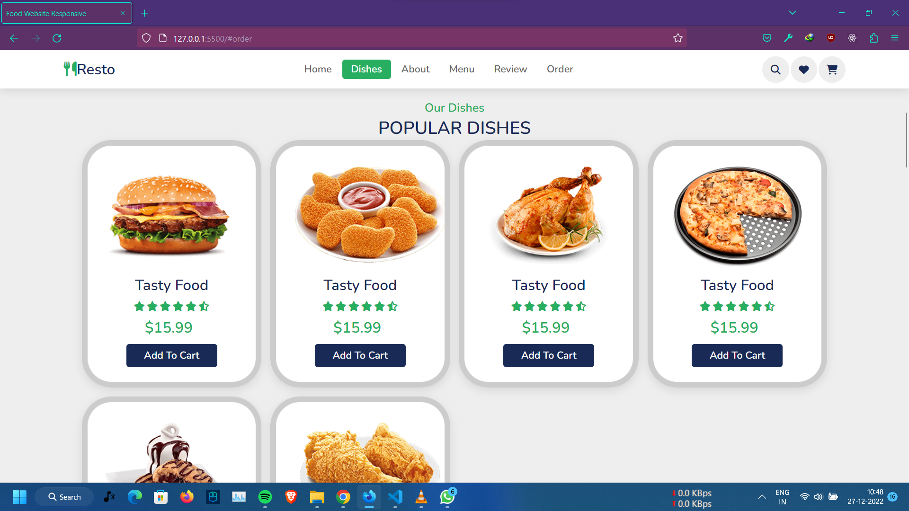
  #### about
  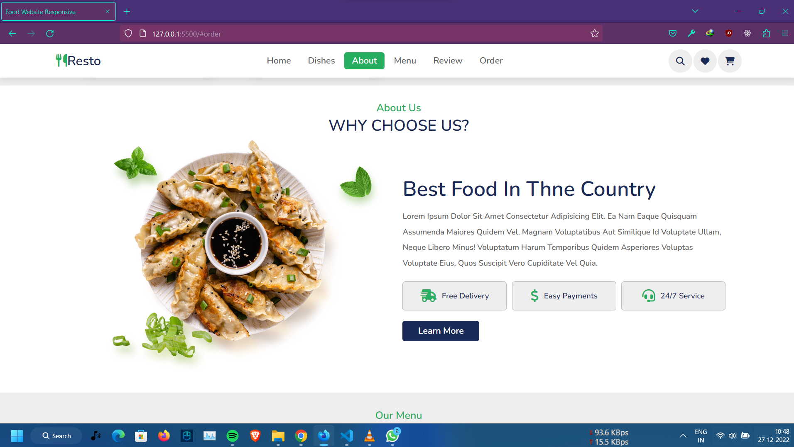
  #### menu
  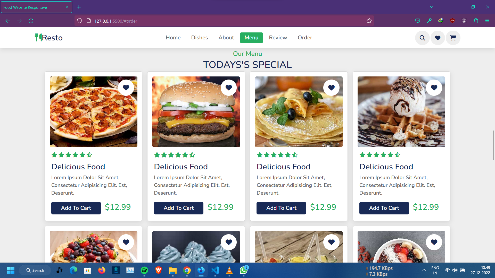
  #### reveiw
  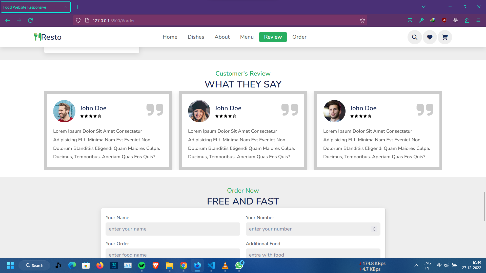
  #### order form
  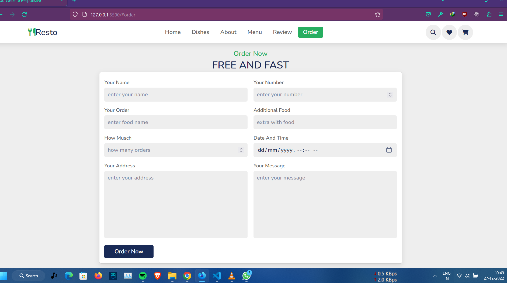
  #### footer
  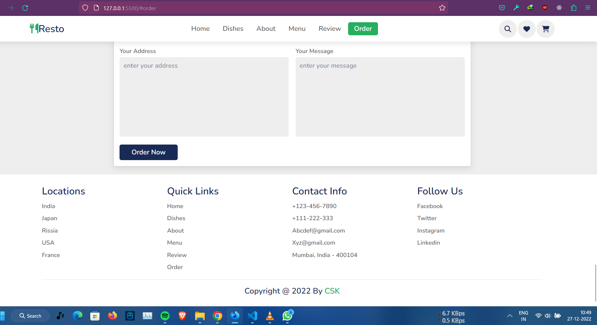


  <br/><br/>  <br/>  <br/>

  # `small screen devices(mobile devices)`
  #### home home
  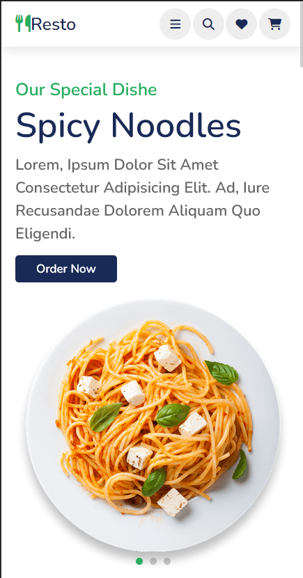 
  #### navbar
  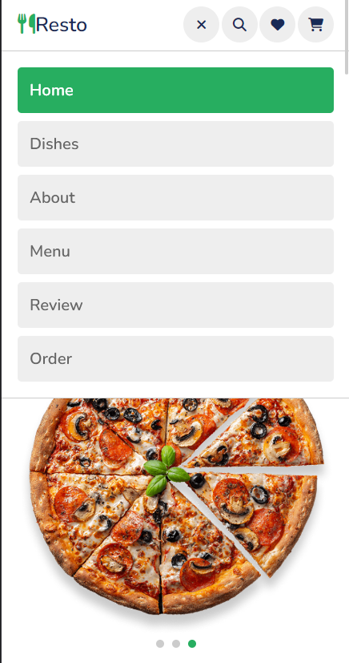 
  #### dishes
  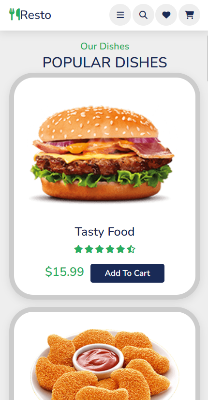
  #### review and order form
  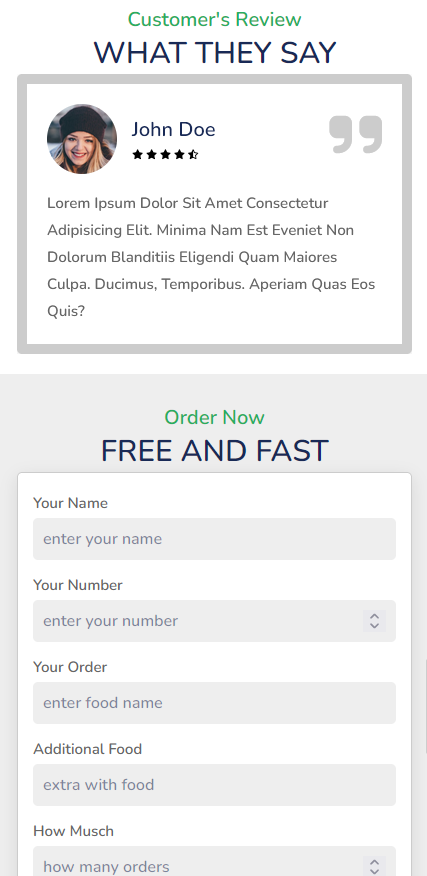
  #### footer
  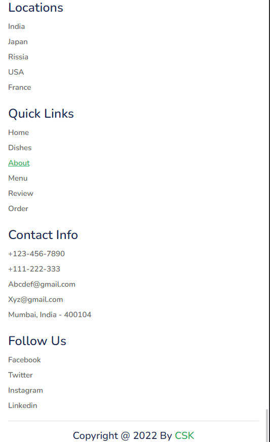


# `TODOs`
  ### CSS
  ```css
  clip-path: polygon(0 0, 100% 0, 100% 0, 0 0);
  z-index:1000;
  scroll-padding-top: 5.5rem;
  scroll-behaviour: smooth;
  overflow-x: hidden;
  display: block;
  position: fixed;
  position: relative;
  display: inline-block;
  media query max-width and min-width 
  ::-webkit-search-cancel-button
  ```
  ### JS
  ```js
    classList.toggle()
```
The classList property returns the CSS classnames of an element.
The classList property returns a DOMTokenList. Tokens: add, remove, toggle, etc.

## libraries
- swiper